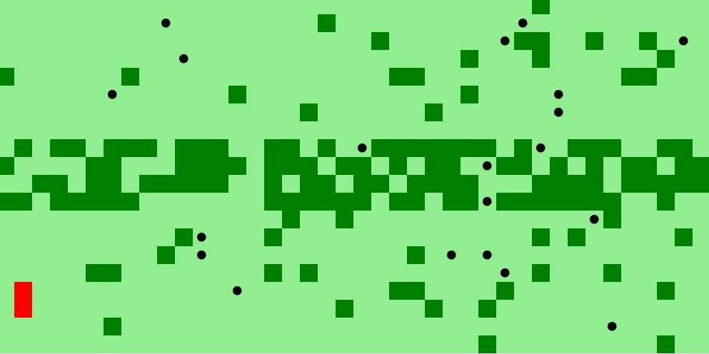
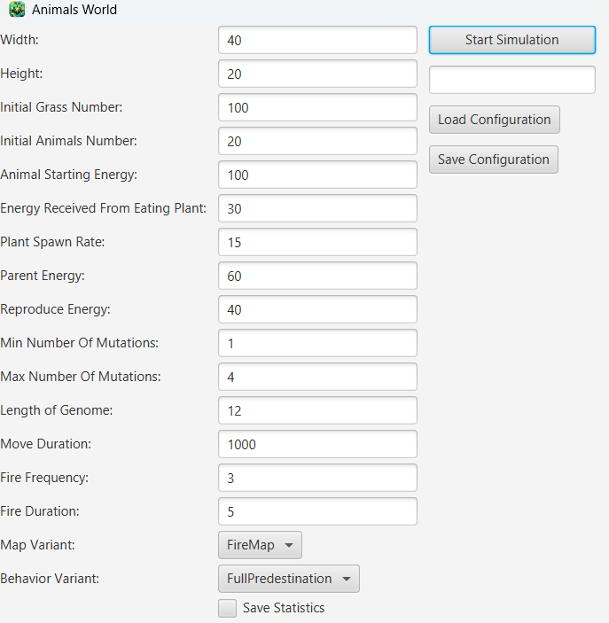
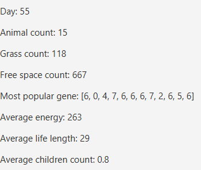
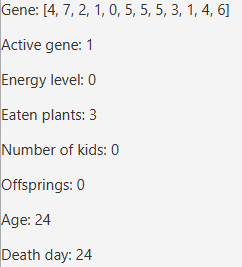

# Darwin World Simulator

A visual, interactive simulator of natural selection written in Java with JavaFX.
Watch animals explore the world, gather energy, escape fire, reproduce, mutate and evolve — with multiple simulations running in parallel.

---

## ✨ Overview

Darwin World Simulator is an object-oriented evolution simulation.
Each creature acts based on its genes, interacts with the environment, and creates offspring with mutations — leading to natural selection over time.

The simulator supports:

- multiple parallel simulations
- pausing & resuming each simulation independently
- detailed statistics for both the map and individual animals

---

## 🧬 Features

✔️ Object-oriented evolutionary model (genes, mutations, inheritance)  
✔️ Multi-threaded — run multiple simulations at once  
✔️ Pause / resume each simulation independently  
✔️ Animals eat grass, gain energy, reproduce, and die  
✔️ Fire events that instantly kill creatures  
✔️ Advanced statistics:  
&nbsp;&nbsp;&nbsp;&nbsp;• global map statistics  
&nbsp;&nbsp;&nbsp;&nbsp;• single-animal statistics   
✔️ JavaFX graphical interface  
✔️ Smooth animation & simulation logic  

---

## 📌 Demo
🐾 Simulation Preview



---

## 📊 Screenshots

# 🔧 Parametry Startowe
Initial Simulation Parameters


# 🌍 Map Statistics



# 🐺 Animal Statistics



---

## ⚙️ How It Works

### 1.Environment

- Grass regrows on the map

- Fire appears randomly and kills nearby animals

### 2.Animals

- Move based on randomised or gene-influenced patterns

- Eat grass to gain energy

- Reproduce when energy is high enough

- Transfer genes with random mutations

---

## ▶️ Running the Project

 ```bash
git clone repo https://github.com/matwoj8/Darwin_World_Simulation.git
cd Darwin_World_Simulation
./gradlew run
```
